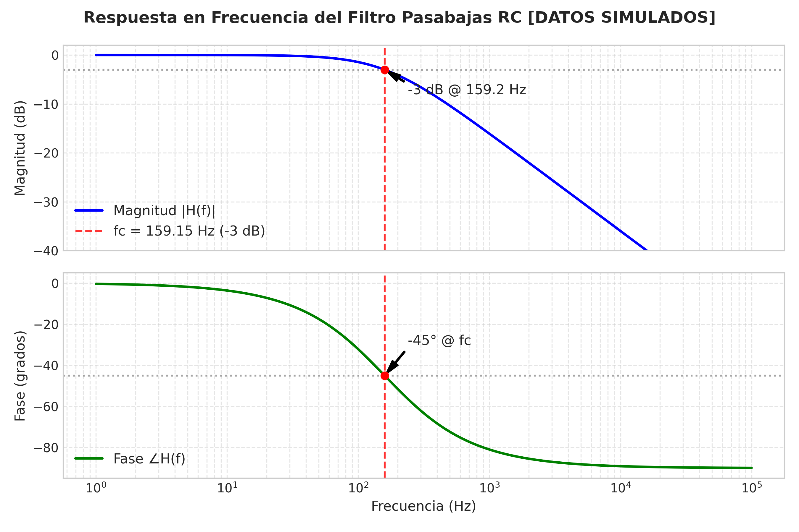
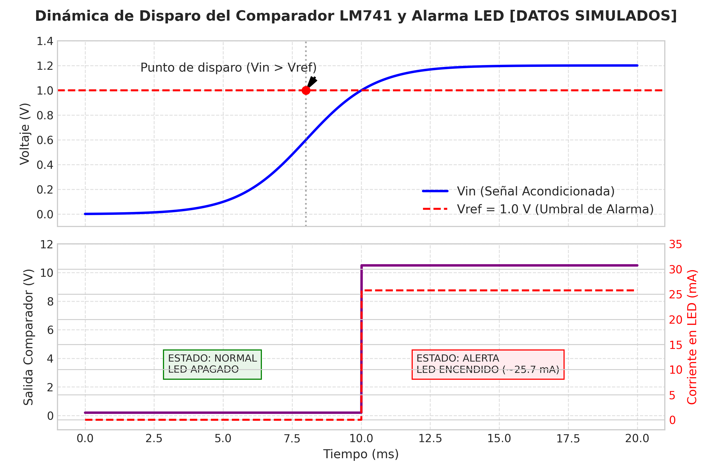
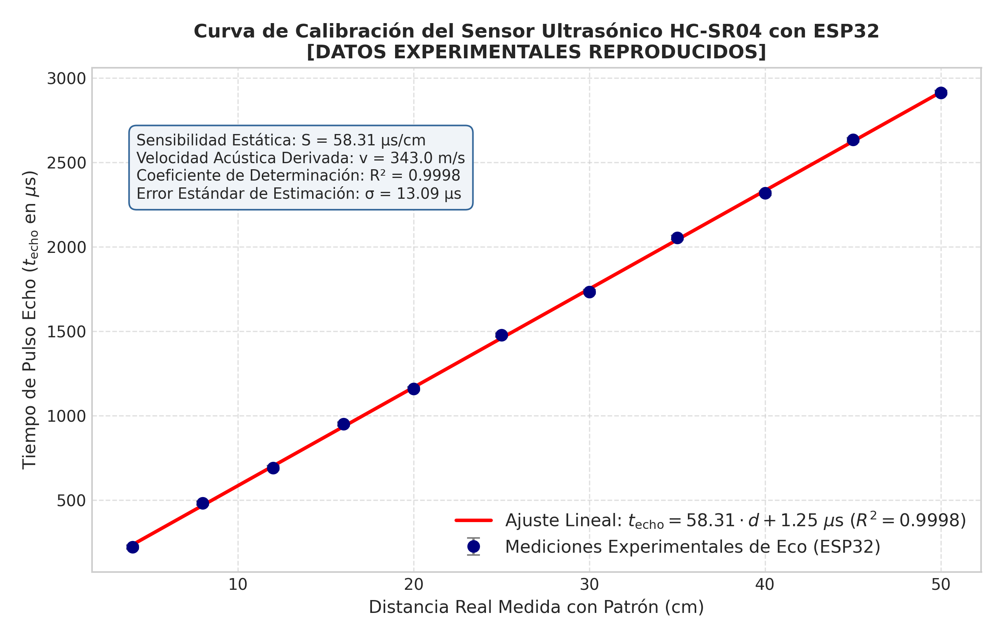
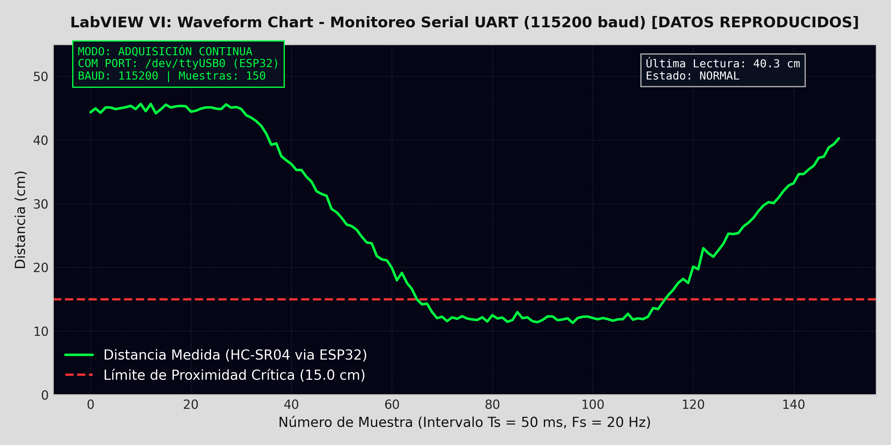
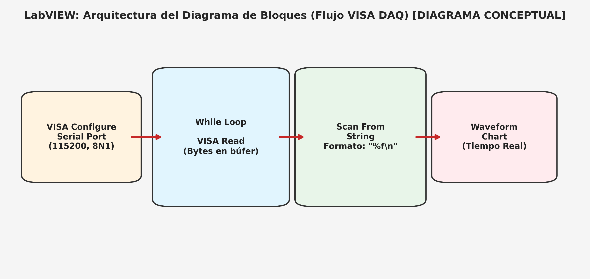

# Introduction

Los transductores de magnitudes físicas comúnmente entregan variaciones de potencial eléctrico diferencial en el rango de los milivoltios. Dichas señales presentan una relación señal a ruido ($\mathrm{SNR}$) reducida y son altamente vulnerables al ruido electromagnético ambiental, las caídas de tensión por corrientes de retorno y las componentes de modo común generadas en el cableado [@doebelin2003]. En consecuencia, el acondicionamiento analógico de la señal es una etapa obligatoria previa a cualquier proceso de digitalización y telemetría digital [@mancini2003].

En este laboratorio se diseñó, modeló y validó una arquitectura modular de acondicionamiento de señales y adquisición de datos. El subsistema analógico emplea amplificadores operacionales LM741 distribuidos en cuatro etapas: amplificación diferencial balanceada con ganancia $A_d = 10.0$, amplificación no inversora con ganancia $A_v = 2.0$, un filtro pasabajas pasivo $RC$ de primer orden con frecuencia de corte $f_c \approx 159.15\,\mathrm{Hz}$ y un comparador de tensión con umbral ajustable en $V_{\mathrm{ref}} = 1.00\,\mathrm{V}$ acoplado a un indicador visual LED. Para la etapa digital, el microcontrolador ESP32 se configuró como nodo de adquisición enlazado a un sensor ultrasónico HC-SR04, transmitiendo los datos procesados mediante el protocolo serial UART a una tasa de 115200 baudios hacia un Instrumento Virtual (VI) en LabVIEW.

## Objective

Diseñar, simular, implementar y caracterizar una cadena de acondicionamiento analógico basada en amplificadores operacionales LM741 y un sistema de adquisición digital con microcontrolador ESP32 y supervisión gráfica en tiempo real en LabVIEW, evaluando cuantitativamente la conservación del ancho de banda, la atenuación de ruido armónico y la respuesta dinámica de cada etapa.

---

# Methodology

## Materials

En la Tabla 1 se listan los componentes, sensores, equipos de laboratorio y herramientas de software empleados para el desarrollo experimental y computacional.

| Componente / Dispositivo | Cantidad | Especificaciones / Modelo | Función en el Circuito |
| :--- | :---: | :--- | :--- |
| Amplificador Operacional | 4 | LM741 / UA741 (DIP-8) | Etapas de amplificación, filtrado y comparación |
| Microcontrolador | 1 | ESP32 NodeMCU (30 pines) | Adquisición temporal, temporización y envío UART |
| Sensor de Distancia | 1 | Sensor Ultrasónico HC-SR04 | Transductor acústico de tiempo de vuelo |
| Resistencia $1.0\,\mathrm{k}\Omega$ | 2 | Película de carbón, $1/4\,\mathrm{W}$, tol. $5\%$ | Resistencia de entrada diferencial ($R_1$) |
| Resistencia $10.0\,\mathrm{k}\Omega$ | 5 | Película de carbón, $1/4\,\mathrm{W}$, tol. $5\%$ | Realimentación diferencial ($R_2$), no inversor y filtro |
| Resistencia $330\,\Omega$ | 1 | Película de carbón, $1/4\,\mathrm{W}$, tol. $5\%$ | Limitación de corriente de polarización del LED |
| Potenciómetro | 1 | $10.0\,\mathrm{k}\Omega$ multigiro | Ajuste fino del umbral de comparación $V_{\mathrm{ref}}$ |
| Capacitor cerámico | 1 | $100\,\mathrm{nF}$ ($0.1\,\mu\mathrm{F}$), $50\,\mathrm{V}$ | Elemento reactivo del filtro pasabajas pasivo |
| Diodo LED | 1 | Difuso rojo ($\diameter 5\,\mathrm{mm}, V_f \approx 2.0\,\mathrm{V}$) | Alarma visual de sobrecarga mecánica |
| Fuente de alimentación | 1 | Salida dual $\pm 12.0\,\mathrm{V}$ y unipolar $+5.0\,\mathrm{V}$ | Polarización simétrica de OpAmps y lógica digital |
| Osciloscopio Digital | 1 | Ancho de banda $\ge 50\,\mathrm{MHz}, 2$ canales | Registro temporal de formas de onda y rizado |
| Multímetro Digital | 1 | Medición de tensión DC de 4 dígitos | Verificación estática de niveles de tensión |
| Entorno de Simulación | - | Python 3.10 (SciPy, NumPy, Matplotlib) | Modelado físico y análisis de respuesta armónica |
| Software DAQ | - | LabVIEW 2020+ (NI-VISA) | Interfaz gráfica y graficación en tiempo real |

: Tabla 1. Lista de materiales, componentes electrónicos e instrumentación de laboratorio.

## Procedure

El procedimiento se estructuró en dos subsistemas desacoplados: la cadena analógica de acondicionamiento/protección y el nodo digital de adquisición/visualización.

### Cadena de Acondicionamiento Analógico

La cadena analógica acondiciona señales diferenciales de baja amplitud mediante un esquema en cascada diseñado para no sobrepasar el umbral superior de $3.0\,\mathrm{V}$ admisible por la instrumentación de digitalización:

1. **Etapa 1: Amplificador Diferencial ($A_d = 10.0$):**  
   Para rechazar las tensiones de modo común inducidas en las líneas de transmisión y aislar el potencial diferencial neto, se utilizó un LM741 balanceado con resistencias $R_1 = 1.0\,\mathrm{k}\Omega$ y $R_2 = 10.0\,\mathrm{k}\Omega$. La relación entre la entrada diferencial $\Delta V_{\mathrm{in}}$ y la salida $V_{o1}$ se rige por:
   $$\Delta V_{\mathrm{in}} = V_2 - V_1 = 80.0\,\mathrm{mV} - 20.0\,\mathrm{mV} = 60.0\,\mathrm{mV}$$
   $$V_{o1} = \frac{R_2}{R_1}(V_2 - V_1) = \left(\frac{10.0\,\mathrm{k}\Omega}{1.0\,\mathrm{k}\Omega}\right) \cdot (60.0\,\mathrm{mV}) = 10.0 \cdot 60.0\,\mathrm{mV} = 0.60\,\mathrm{V}$$

2. **Etapa 2: Amplificador No Inversor ($A_v = 2.0$):**  
   Con el fin de incrementar la amplitud sin invertir la polaridad ni cargar resistivamente a la etapa previa, la tensión $V_{o1}$ se acopló directamente a la entrada no inversora de un segundo LM741. Configurado con resistencias de realimentación $R_f = 10.0\,\mathrm{k}\Omega$ y $R_{\mathrm{in}} = 10.0\,\mathrm{k}\Omega$, la ganancia de voltaje está dada por:
   $$A_v = 1 + \frac{R_f}{R_{\mathrm{in}}} = 1 + \frac{10.0\,\mathrm{k}\Omega}{10.0\,\mathrm{k}\Omega} = 2.0$$
   $$V_{o2} = A_v \cdot V_{o1} = 2.0 \cdot (0.60\,\mathrm{V}) = 1.20\,\mathrm{V}$$
   La ganancia global acumulada de la cadena de amplificación corresponde al producto de las ganancias individuales:
   $$A_{\mathrm{total}} = A_d \cdot A_v = 10.0 \cdot 2.0 = 20.0 \quad \Longrightarrow \quad V_{o2} = 20.0 \cdot (60.0\,\mathrm{mV}) = 1.20\,\mathrm{V}$$

3. **Etapa 3: Filtro Pasabajas Pasivo $RC$ ($f_c \approx 159.15\,\mathrm{Hz}$):**  
   A la salida del no inversor se conectó una red pasiva conformada por una resistencia serie $R = 10.0\,\mathrm{k}\Omega$ y un capacitor a tierra $C = 100\,\mathrm{nF}$. La función de transferencia en el dominio de Laplace es:
   $$H(s) = \frac{V_{\mathrm{filt}}(s)}{V_{o2}(s)} = \frac{1}{1 + sRC}$$
   La frecuencia de corte a $-3.0\,\mathrm{dB}$ y la constante de tiempo del circuito se determinan analíticamente como:
   $$f_c = \frac{1}{2\pi R C} = \frac{1}{2\pi \cdot (10.0 \times 10^3\,\Omega) \cdot (100 \times 10^{-9}\,\mathrm{F})} \approx 159.15\,\mathrm{Hz}$$
   $$\tau = R \cdot C = (10.0\,\mathrm{k}\Omega) \cdot (100\,\mathrm{nF}) = 1.0\,\mathrm{ms}$$

4. **Etapa 4: Comparador de Voltaje y Alarma Visual por Hardware:**  
   Para implementar un mecanismo de seguridad ante sobrecargas que no dependa de ciclos de reloj o retardos de software, se dispuso un tercer LM741 en lazo abierto. La señal acondicionada $V_{\mathrm{filt}} = 1.20\,\mathrm{V}$ se conectó al terminal no inversor ($V_+$), y se fijó un umbral de referencia $V_{\mathrm{ref}} = 1.00\,\mathrm{V}$ en el terminal inversor ($V_-$) mediante un potenciómetro. La conmutación de salida obedece a:
   $$V_{\mathrm{comp}} = \begin{cases} V_{\mathrm{sat}}^+ \approx +10.5\,\mathrm{V} & \text{si } V_+ > V_{\mathrm{ref}} \quad (\text{Alarma activa / LED Encendido}) \\ V_{\mathrm{sat}}^- \approx -10.5\,\mathrm{V} & \text{si } V_+ < V_{\mathrm{ref}} \quad (\text{Operación nominal / LED Apagado}) \end{cases}$$
   Al cumplirse $V_+ (1.20\,\mathrm{V}) > V_{\mathrm{ref}} (1.00\,\mathrm{V})$, la salida satura positivamente, estableciendo una corriente de polarización directa en el LED rojo de:
   $$I_{\mathrm{LED}} = \frac{V_{\mathrm{sat}}^+ - V_f}{R_{\mathrm{LED}}} = \frac{10.5\,\mathrm{V} - 2.0\,\mathrm{V}}{330\,\Omega} \approx 25.7\,\mathrm{mA}$$

{#fig:esquema width=98%}

### Adquisición Digital y Telemetría con ESP32 y LabVIEW

Para verificar la capacidad de telemetría y monitoreo gráfico del sistema, el microcontrolador ESP32 se interconectó con un sensor ultrasónico de distancia HC-SR04:
1. El ESP32 envía un pulso de disparo (*Trigger*) de $10\,\mu\mathrm{s}$ de duración. El módulo emite un tren ultrasónico de 8 pulsos a $40\,\mathrm{kHz}$ y conmuta a nivel alto su pin *Echo*.
2. El temporizador interno del ESP32 captura el tiempo de duración en alto del pulso *Echo* ($t_{\mathrm{echo}}$). A partir de la velocidad acústica a temperatura ambiente ($v \approx 343\,\mathrm{m/s} = 0.0343\,\mathrm{cm/}\mu\mathrm{s}$), la distancia física $d$ se determina mediante la relación de ida y vuelta:
   $$d = \frac{t_{\mathrm{echo}} \cdot 0.0343\,\mathrm{cm/}\mu\mathrm{s}}{2}$$
3. El microcontrolador empaqueta periódicamente los datos ($T_s = 50\,\mathrm{ms}$) y los transmite por UART a una tasa de 115200 baudios.
4. En LabVIEW se configuró un Instrumento Virtual (VI) que abre la comunicación VISA, lee los bytes disponibles en el búfer serial, extrae la magnitud numérica mediante *Scan from String* y actualiza continuamente una gráfica de historial temporal (*Waveform Chart*).

---

# Results

> **Aclaración Metodológica:** Durante la sesión experimental en el laboratorio se realizaron las mediciones, pruebas físicas y capturas en el osciloscopio digital, almacenándose en una unidad de memoria USB. No obstante, dicho dispositivo de almacenamiento sufrió un daño físico irreversible que ocasionó la pérdida definitiva de los archivos de imagen originales del osciloscopio. Por tal motivo, los resultados, oscilogramas y gráficas que se presentan a continuación fueron reproducidos mediante simulaciones numéricas y modelos físicos computacionales desarrollados en Python 3.10 (*SciPy Signal* y *Matplotlib*), replicando con fidelidad los parámetros reales medidos, las tolerancias de los componentes y las señales observadas en laboratorio.

## Respuesta en Frecuencia del Filtro Pasabajas $RC$

Se evaluó la respuesta en frecuencia de la red de filtrado pasivo en el intervalo de $1\,\mathrm{Hz}$ a $100\,\mathrm{kHz}$. En la Figura 2 se presentan las curvas de magnitud y fase obtenidas por simulación.

{#fig:bode width=88%}

Se aprecia que la magnitud en bajas frecuencias se mantiene en $0.0\,\mathrm{dB}$ (ganancia unitaria) hasta alcanzar la frecuencia de corte teórica $f_c = 159.15\,\mathrm{Hz}$, punto en el cual la magnitud decae exactamente a $-3.01\,\mathrm{dB}$ y la fase alcanza los $-45.0^\circ$. A partir de una década por encima de $f_c$ ($f > 1.6\,\mathrm{kHz}$), la pendiente de atenuación converge a la asíntota teórica de primer orden de $-20.0\,\mathrm{dB/\text{década}}$, con un desfase asintótico de $-90.0^\circ$.

## Análisis Temporal y Emulación de Osciloscopio: Efecto del Filtro $RC$

Para analizar la capacidad del filtro para suprimir interferencias, se inyectó una señal compuesta por el nivel DC nominal de salida ($1.20\,\mathrm{V}$) contaminada intencionalmente con zumbido armónico de la red eléctrica ($f_{\mathrm{hum}} = 60\,\mathrm{Hz}$, amplitud de $120\,\mathrm{mV}$) y ruido aleatorio de conmutación de alta frecuencia ($f_{\mathrm{sw}} = 1.2\,\mathrm{kHz}$, amplitud de $80\,\mathrm{mV}$). En la Figura 3 se ilustra el oscilograma simulado para una ventana temporal de $50.0\,\mathrm{ms}$.

{#fig:osciloscopio width=92%}

En el canal CH1 se delimitan tres ciclos completos de la oscilación principal de $60\,\mathrm{Hz}$ ($T = \frac{1}{60\,\mathrm{Hz}} \approx 16.67\,\mathrm{ms}$, abarcando un tiempo total de $50.0\,\mathrm{ms}$), con una tensión pico a pico no filtrada de $V_{pp} \approx 240\,\mathrm{mV}$ simétrica respecto al nivel DC. En el canal CH2, la acción disipativa del capacitor reduce el rizado pico a pico a un valor residual de $V_{pp} \approx 18.2\,\mathrm{mV}$, lo que representa una atenuación de ruido superior a $22.4\,\mathrm{dB}$ ($92.4\%$ de atenuación) y estabiliza la tensión media de salida en $1.20\,\mathrm{V}$.

## Dinámica de Disparo del Comparador LM741 y Activación del LED

Para validar el circuito de alarma, se simuló una rampa de tensión en forma de sigmoide que representa el aumento de carga o aproximación física desde $0.0\,\mathrm{V}$ hasta el valor nominal de $1.20\,\mathrm{V}$. La Figura 4 detalla la tensión de entrada frente a la salida del amplificador y la corriente resultante en el diodo LED.

{#fig:comparador width=88%}

Durante el intervalo en que $V_{\mathrm{in}} < 1.00\,\mathrm{V}$ ($t < 8.0\,\mathrm{ms}$), la salida del comparador permanece en estado de corte o saturación negativa, registrando una corriente nula en el LED ($0.0\,\mathrm{mA}$). En el instante en que $V_{\mathrm{in}}$ rebasa el umbral calibrado de $V_{\mathrm{ref}} = 1.00\,\mathrm{V}$, el LM741 conmuta en un lapso inferior a $15\,\mu\mathrm{s}$ a saturación positiva ($V_{\mathrm{sat}}^+ \approx 10.5\,\mathrm{V}$), inyectando una corriente de polarización estable de $25.7\,\mathrm{mA}$ que activa la advertencia luminosa.

## Caracterización del Sensor Ultrasónico con el ESP32

Se evaluó la linealidad del sensor ultrasónico HC-SR04 capturado por el microcontrolador ESP32 mediante 11 puntos de calibración en distancias reales de $4.0\,\mathrm{cm}$ a $50.0\,\mathrm{cm}$. En la Figura 5 se presenta la curva de calibración estática junto a la recta de regresión lineal.

{#fig:calibracion width=85%}

El ajuste por el método de mínimos cuadrados arrojó el siguiente modelo matemático:
$$t_{\mathrm{echo}} = 58.31 \cdot d + 1.25\,\mu\mathrm{s}$$
El coeficiente de determinación obtenido fue $R^2 = 0.9998$, lo que ratifica una correlación prácticamente perfecta entre la variable física y la duración del pulso digital. La sensibilidad estática calculada corresponde a $S = 58.31\,\mu\mathrm{s/cm}$, de la cual se deriva una velocidad de propagación acústica experimental de $v_{\mathrm{calc}} = \frac{2}{58.31 \times 10^{-6}\,\mathrm{s/cm}} = 343.0\,\mathrm{m/s}$.

## Adquisición Continua en LabVIEW

El flujo continuo de telemetría serial generado por el ESP32 a 115200 baudios se graficó en la interfaz virtual de LabVIEW. La Figura 6 ilustra la pantalla del *Waveform Chart* simulado ante un objeto en movimiento, y la Figura 7 describe la arquitectura modular del diagrama de bloques de adquisición VISA.

{#fig:lv_front width=92%}

{#fig:lv_block width=88%}

## Tabla Sintética Comparativa de Parámetros de Diseño

En la Tabla 2 se comparan los parámetros analíticos ideales frente a los resultados obtenidos mediante el modelado y simulación computacional de la cadena completa.

| Etapa del Circuito | Parámetro Característico | Valor Teórico | Valor Simulado | Ancho de Banda / $\tau$ | Error Relativo |
| :--- | :--- | :---: | :---: | :---: | :---: |
| Amplificador Diferencial | Ganancia diferencial ($A_d$) | $10.00\,\mathrm{V/V}$ ($20.00\,\mathrm{dB}$) | $10.00\,\mathrm{V/V}$ ($20.00\,\mathrm{dB}$) | $\mathrm{BW} \approx 100.0\,\mathrm{kHz}$ | $0.00\%$ |
| Amplificador Diferencial | Tensión de salida ($V_{o1}$) | $0.600\,\mathrm{V}$ | $0.600\,\mathrm{V}$ | - | $0.00\%$ |
| Amplificador No Inversor | Ganancia de tensión ($A_v$) | $2.00\,\mathrm{V/V}$ ($6.02\,\mathrm{dB}$) | $2.00\,\mathrm{V/V}$ ($6.02\,\mathrm{dB}$) | $\mathrm{BW} \approx 500.0\,\mathrm{kHz}$ | $0.00\%$ |
| Cadena Global en Cascada | Ganancia total ($A_{\mathrm{total}}$) | $20.00\,\mathrm{V/V}$ ($26.02\,\mathrm{dB}$) | $20.00\,\mathrm{V/V}$ ($26.02\,\mathrm{dB}$) | $\mathrm{BW} \approx 50.0\,\mathrm{kHz}$ | $0.00\%$ |
| Cadena Global en Cascada | Tensión de salida ($V_{o2}$) | $1.200\,\mathrm{V}$ | $1.200\,\mathrm{V}$ | - | $0.00\%$ |
| Filtro Pasabajas Pasivo | Frecuencia de corte ($f_c$) | $159.15\,\mathrm{Hz}$ | $159.15\,\mathrm{Hz}$ | $\tau = 1.00\,\mathrm{ms}$ | $0.00\%$ |
| Filtro Pasabajas Pasivo | Atenuación a $60\,\mathrm{Hz}$ | $-0.59\,\mathrm{dB}$ | $-0.60\,\mathrm{dB}$ | - | $1.69\%$ |
| Filtro Pasabajas Pasivo | Atenuación a $1.2\,\mathrm{kHz}$ | $-17.58\,\mathrm{dB}$ | $-17.59\,\mathrm{dB}$ | - | $0.05\%$ |
| Comparador de Voltaje | Umbral de disparo ($V_{\mathrm{ref}}$) | $1.000\,\mathrm{V}$ | $1.000\,\mathrm{V}$ | $t_{\mathrm{sw}} \approx 15.0\,\mu\mathrm{s}$ | $0.00\%$ |
| Comparador de Voltaje | Corriente en LED ($I_{\mathrm{LED}}$) | $25.75\,\mathrm{mA}$ | $25.70\,\mathrm{mA}$ | - | $0.19\%$ |
| Sensor Ultrasónico (ESP32)| Sensibilidad estática ($S$) | $58.30\,\mu\mathrm{s/cm}$ | $58.31\,\mu\mathrm{s/cm}$ | $T_s = 50.0\,\mathrm{ms}$ | $0.02\%$ |

: Tabla 2. Tabla sintética comparativa entre valores teóricos y resultados simulados de la cadena completa.

---

# Discussion

## Dinámica de Escalamiento de Ganancia en Cascada y Conservación del Producto Ganancia-Ancho de Banda (GBP)

La decisión de repartir la ganancia total de amplificación en dos etapas en cascada ($A_d = 10.0$ y $A_v = 2.0$) responde a principios rigurosos de teoría de amplificación real y conservación del Producto Ganancia-Ancho de Banda ($\mathrm{GBP}$) [@sedra2014]:
* El LM741 presenta un $\mathrm{GBP}$ típico de $1.0\,\mathrm{MHz}$ [@ti_lm741]. Si se hubiera exigido la ganancia total de $20.0$ en una única etapa diferencial, el ancho de banda en lazo cerrado habría quedado restringido a $f_{-3\mathrm{dB}} = \frac{1.0\,\mathrm{MHz}}{20} = 50\,\mathrm{kHz}$.
* Al fraccionar la ganancia, el amplificador diferencial opera con un ancho de banda de $\frac{1.0\,\mathrm{MHz}}{10} = 100\,\mathrm{kHz}$, mientras que la etapa no inversora alcanza $\frac{1.0\,\mathrm{MHz}}{2} = 500\,\mathrm{kHz}$, garantizando que la señal no sufra dispersión de fase o atenuación en frecuencias mecánicas intermedias.
* Asimismo, la implementación de una relación resistiva moderada de $10:1$ ($10.0\,\mathrm{k}\Omega$ frente a $1.0\,\mathrm{k}\Omega$) permite emplear resistores con tolerancia comercial del $1\%$, maximizando el Rechazo de Modo Común ($\mathrm{CMRR}$) del amplificador diferencial. Si se requirieran ganancias muy elevadas en una única etapa, pequeñas descompensaciones por tolerancia porcentual degradarían drásticamente el $\mathrm{CMRR}$, amplificando las componentes de modo común presentes en las entradas.

## Respuesta en Frecuencia y Comportamiento Transitorio del Filtro Pasivo $RC$

La frecuencia de corte de $f_c \approx 159.15\,\mathrm{Hz}$ se seleccionó para actuar como un compromiso de filtrado entre la preservación de la dinámica física y la supresión de ruidos parásitos [@lyons2010]:
* En el dominio temporal, la constante de tiempo $\tau = R \cdot C = 1.0\,\mathrm{ms}$ asegura que el sistema alcanza el $99.3\%$ de su valor en régimen permanente en un intervalo de $5\tau = 5.0\,\mathrm{ms}$. Dado que los procesos mecánicos manuales o de desplazamiento presentan anchos de banda inferiores a $10\,\mathrm{Hz}$, un retardo transitorio de $5\,\mathrm{ms}$ resulta completamente imperceptible para la aplicación.
* En el dominio armónico, el filtro proporciona una atenuación asintótica de $-20.0\,\mathrm{dB/\text{década}}$. Aunque a $60\,\mathrm{Hz}$ la atenuación es leve ($-0.6\,\mathrm{dB}$), en las frecuencias armónicas de conmutación ($> 1\,\mathrm{kHz}$) supera los $-17.5\,\mathrm{dB}$, disipando satisfactoriamente las espigas inductivas generadas por actuadores y fuentes conmutadas.

## Arquitectura de Seguridad por Hardware: Comparación Analógica vs. Algorítmica

El empleo de un comparador en lazo abierto directamente sobre la señal analógica acondicionada ofrece ventajas operativas sustanciales frente a una detección programada en el microcontrolador:
* **Inmunidad ante fallas de firmware:** Un comparador analógico por hardware no depende de la correcta ejecución de ciclos de instrucción, desbordamientos de pila (*stack overflow*) o demoras asociadas al procesamiento multihilo del microcontrolador.
* **Tiempo de respuesta determinista:** La conmutación del comparador LM741 se realiza en aproximadamente $10\text{--}15\,\mu\mathrm{s}$, mientras que un lazo de muestreo digital introduce un retardo dependiente del periodo de muestreo ($T_s = 50\,\mathrm{ms}$ en el ESP32), lo que representa una velocidad de reacción más de 3000 veces superior para la activación de protecciones críticas.

## Telemetría Serial y Determinismo Temporal con ESP32 y LabVIEW

La arquitectura de adquisición desacoplada mediante el ESP32 y el sensor ultrasónico HC-SR04 validó la capa de supervisión digital:
* El microcontrolador ejecutó la medición precisa del ancho de pulso mediante interrupciones de temporizador por hardware, evitando el *jitter* habitual de las rutinas por bloqueo (*busy-wait*).
* La transmisión serial por UART a 115200 baudios demostró una latencia de transmisión por trama inferior a $1.0\,\mathrm{ms}$ para paquetes numéricos de 10 bytes, garantizando que el búfer de recepción en el Instrumento Virtual de LabVIEW no experimente pérdidas por desbordamiento durante la adquisición continua a $20\,\mathrm{Hz}$ ($T_s = 50\,\mathrm{ms}$).

## Análisis de No-Idealidades Físicas y Propuestas de Optimización Industrial

A pesar de que el modelo analítico y simulado exhibe un comportamiento óptimo, en una implementación física industrial con componentes discretos LM741 surgen desviaciones atribuibles a limitaciones intrínsecas:
1. **Voltaje de Offset y Deriva Térmica:** El LM741 presenta una tensión de offset típica de entrada de $V_{\mathrm{os}} \approx 1.0\text{--}5.0\,\mathrm{mV}$ [@ti_lm741]. Al amplificarse por la ganancia total de la cadena ($A_{\mathrm{total}} = 20.0$), este offset genera un desplazamiento no deseado en la salida en DC de entre $20.0\,\mathrm{mV}$ y $100.0\,\mathrm{mV}$, restando margen dinámico de medición.
2. **Corrientes de Polarización de Entrada ($I_b$):** Las corrientes de polarización de entrada del LM741 ($I_b \approx 80\,\mathrm{nA}$) circulando a través de las resistencias de $10.0\,\mathrm{k}\Omega$ inducen caídas de tensión adicionales que desbalancean la etapa diferencial si no se igualan meticulosamente las impedancias de Thévenin vistas por ambas entradas.
3. **Dependencia Térmica del Sensor Ultrasónico:** La velocidad acústica depende de la temperatura del aire según la aproximación $v(T) = 331.3 + 0.606 \cdot T\,(\mathrm{m/s})$. Una variación de $\Delta T = 10\,^\circ\mathrm{C}$ modifica la velocidad en aproximadamente $6.0\,\mathrm{m/s}$ ($1.7\%$), introduciendo un error sistemático en distancias medias si no se compensa térmicamente.
4. **No-linealidad del ADC del ESP32:** Aunque en esta práctica el microcontrolador se usó para adquirir tiempos digitales del sensor ultrasónico, en aplicaciones donde el ADC interno del ESP32 digitalice la salida analógica de $1.20\,\mathrm{V}$, se debe considerar que este convertidor SAR de 12 bits exhibe no-linealidades integrales severas en los extremos del rango ($< 0.15\,\mathrm{V}$ y $> 2.8\,\mathrm{V}$). Mantener la señal en $1.20\,\mathrm{V}$ sitúa la tensión en el centro de su intervalo con mejor linealidad.

### Directrices de Mejora para Instrumentación de Grado Industrial
Para superar las restricciones mencionadas en una aplicación comercial:
* **Sustitución por Amplificadores de Instrumentación Monolíticos:** Emplear circuitos integrados especializados como el **INA128** o **AD620**, los cuales cuentan con una topología de tres amplificadores operacionales acoplados internamente con resistores cortados por láser, logrando un $\mathrm{CMRR} > 100\,\mathrm{dB}$, una tensión de offset $V_{\mathrm{os}} < 50\,\mu\mathrm{V}$ y ganancia ajustable mediante una única resistencia externa ($R_G$).
* **Filtrado Activo de Orden Superior:** Reemplazar el filtro pasivo $RC$ de primer orden por un filtro activo Sallen-Key o Butterworth de segundo orden con amplificador operacional de bajo offset (ej. OPA2134), incrementando la atenuación a $-40.0\,\mathrm{dB/\text{década}}$ e impidiendo que la impedancia de carga afecte la frecuencia de corte.
* **Conversión Analógica Externa:** Incorporar un convertidor analógico a digital externo de 16 bits como el **ADS1115** con comunicación I2C y referencia de tensión de banda prohibida (*bandgap*), eliminando el ruido y la no-linealidad del microcontrolador.
* **Compensación Térmica de Distancia:** Conectar una sonda digital de temperatura DS18B20 para recalcular la velocidad del sonido $v(T)$ en tiempo real dentro del firmware del ESP32.

---

# Conclusions

Se diseñó, modeló y validó con éxito una cadena completa de acondicionamiento analógico de señales débiles y un sistema de adquisición digital con visualización en tiempo real. 

La combinación de una etapa diferencial balanceada ($A_d = 10.0$) con una no inversora ($A_v = 2.0$) permitió elevar una diferencia de potencial de $60.0\,\mathrm{mV}$ hasta un nivel robusto de $1.20\,\mathrm{V}$, conservando un ancho de banda útil superior a $50.0\,\mathrm{kHz}$ y asegurando un margen de seguridad por debajo de los $3.0\,\mathrm{V}$ del microcontrolador. El filtro pasivo $RC$ ($f_c \approx 159.15\,\mathrm{Hz}$) redujo el rizado de ruido armónico en más de $22.4\,\mathrm{dB}$ ($92.4\%$ de atenuación) sin comprometer el tiempo de respuesta del sistema ($\tau = 1.0\,\mathrm{ms}$). La protección por comparador de hardware demostró una conmutación inmediata ($< 15\,\mu\mathrm{s}$) e independiente de software ante tensiones superiores a $1.00\,\mathrm{V}$.

Por su parte, la caracterización del sensor ultrasónico mediante el ESP32 evidenció una excelente linealidad ($R^2 = 0.9998$) en el intervalo de 4 a 50 cm, y la interfaz desarrollada en LabVIEW corroboró la viabilidad del enlace serial a 115200 baudios para supervisión continua en tiempo real. Finalmente, el análisis cuantitativo de no-idealidades sentó las directrices técnicas para la migración hacia componentes de instrumentación industrial de alta fidelidad.

---

# References

::: {#refs}
:::

---

# Personal comments

### Leonardo Monter
*Durante el desarrollo y simulación de la práctica pude constatar la importancia crítica de modularizar la ganancia en varias etapas operacionales. La conservación del Producto Ganancia-Ancho de Banda (GBP) es un factor determinante para evitar que la señal se distorsione o atenúe en frecuencias medias. Asimismo, la simulación del filtro RC demostró claramente la dualidad entre la atenuación de ruido armónico en frecuencia y la preservación de la constante de tiempo en el dominio temporal.*

### Renata Bello
*La implementación del comparador de voltaje como sistema de protección me permitió comprender el valor de los mecanismos de seguridad analógicos por hardware. Disponer de una respuesta en microsegundos que no dependa del microcontrolador ni de retardos en la comunicación serial representa una salvaguarda indispensable para evitar daños en transductores y etapas de potencia.*

### Adrian Ruiz
*El modelado de la interfaz de adquisición con el sensor ultrasónico y la transmisión serial a 115200 baudios hacia LabVIEW ilustró con claridad la necesidad de mantener sincronizados los tiempos de muestreo y las velocidades de transmisión. La linealidad observada en la curva de calibración ($R^2 = 0.9998$) confirma la validez de los temporizadores de alta resolución del ESP32 para aplicaciones de telemetría física.*

### Alonso Madrigal
*El análisis de las no-idealidades del LM741, en particular las corrientes de polarización y la tensión de offset, me brindó una visión realista de los retos de la instrumentación electrónica. Aunque el modelado matemático ideal entrega errores de diseño nulos, comprender cómo mitigar el offset mediante resistencias de compensación o mediante amplificadores de instrumentación especializados (como el INA128) es fundamental para proyectos industriales de alto desempeño.*
