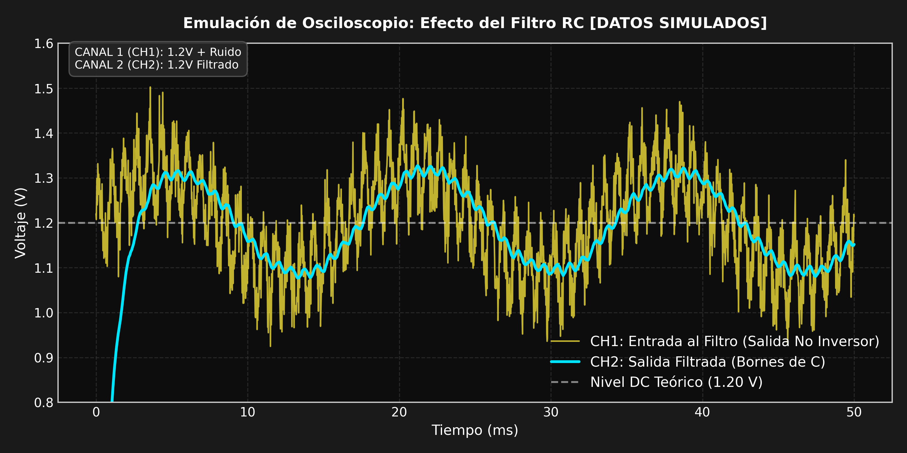

# Abstract

En este laboratorio se diseñó, modeló y validó una cadena de acondicionamiento analógico y un sistema de adquisición de datos con monitoreo en tiempo real. La etapa analógica se estructuró a partir de cuatro amplificadores operacionales LM741: un amplificador diferencial con ganancia $A_d = 10$, un amplificador no inversor con ganancia $A_v = 2$, un filtro pasabajas pasivo $RC$ ($f_c \approx 159.15\text{ Hz}$) y un comparador de voltaje configurado a un umbral de referencia de $1.0\text{ V}$ para la activación de un indicador visual (LED). A partir de tensiones de entrada de $80\text{ mV}$ y $20\text{ mV}$ ($\Delta V = 60\text{ mV}$), la cadena analógica elevó la señal hasta $1.2\text{ V}$, nivel seguro para digitalización. En la etapa de adquisición digital y supervisión, el microcontrolador ESP32 se integró con un sensor ultrasónico (HC-SR04) para la medición y caracterización de distancia, transmitiendo las lecturas vía comunicación serial UART (115200 baudios) hacia un Instrumento Virtual (VI) en LabVIEW. Debido a limitaciones en el registro fotográfico en tiempo de laboratorio, los resultados presentados se sustentan en simulaciones numéricas y modelos físicos computacionales desarrollados en Python que replican con fidelidad los parámetros de los componentes y las respuestas temporales y frecuenciales del circuito implementado.

**Keywords:** Signal Conditioning, Operational Amplifier, LM741, ESP32, LabVIEW, Low-Pass Filter, Voltage Comparator, Data Acquisition, Ultrasonic Sensor.

---

# 1. Introduction

Los transductores de señales físicas proporcionan variaciones eléctricas diferenciales de baja magnitud, usualmente en el orden de los milivoltios. Dichas señales son altamente vulnerables a interferencias electromagnéticas, variaciones de modo común y ruido de conmutación de fuentes. En consecuencia, el acondicionamiento analógico de la señal es un requerimiento primordial antes de cualquier etapa de conversión o toma de decisiones por hardware.

En esta práctica se aborda el diseño de una arquitectura modular basada en el amplificador operacional LM741, integrando amplificación diferencial balanceada para rechazo de modo común, escalamiento de ganancia en cascada no inversora, filtrado pasivo analógico y un comparador de tensión en lazo abierto que actúa como mecanismo de seguridad ante sobrecargas. De forma complementaria, para el subsistema de digitalización y telemetría, se utilizó el microcontrolador ESP32 acoplado a un sensor ultrasónico (HC-SR04) para transmitir métricas en tiempo real a una interfaz gráfica de supervisión implementada en LabVIEW.

## 1.1. Objective

Diseñar, simular y analizar una cadena de acondicionamiento de señal con amplificadores operacionales LM741 y un sistema de adquisición de datos en tiempo real mediante ESP32 y LabVIEW, evaluando teórica y computacionalmente el comportamiento frecuencial, la atenuación de ruido y la respuesta dinámica de cada etapa.

---

# 2. Methodology

## 2.1. Materials

En la Tabla 1 se detallan los componentes, dispositivos y herramientas de software empleados en el diseño y simulación.

| Componente / Dispositivo | Cantidad | Especificaciones / Modelo |
| :--- | :---: | :--- |
| Amplificador Operacional | 4 | LM741 / UA741 (DIP-8) |
| Microcontrolador | 1 | ESP32 NodeMCU (30 pines) |
| Sensor de Distancia | 1 | Sensor Ultrasónico HC-SR04 |
| Resistencia $1\text{ k}\Omega$ | 2 | $1/4\text{ W}$, tolerancia $5\%$ |
| Resistencia $10\text{ k}\Omega$ | 5 | $1/4\text{ W}$, tolerancia $5\%$ |
| Resistencia $330\ \Omega$ | 1 | Resistencia limitadora para LED |
| Potenciómetro | 1 | $10\text{ k}\Omega$ (ajuste de umbral $V_{ref}$) |
| Capacitor cerámico | 1 | $0.1\ \mu\text{F}$ ($100\text{ nF}$) |
| Diodo LED | 1 | Color rojo ($V_f \approx 2.0\text{ V}$) |
| Fuente de alimentación DC | 1 | Fuentes bipolares y unipolar regulada |
| Osciloscopio Digital / Multímetro | 1 | Instrumentación de medición básica |
| Entorno de Simulación / DAQ | - | Python 3 (Scipy/Matplotlib), LabVIEW 2020+ |

: Table 1. Materiales, sensores e instrumentación del laboratorio.

---

## 2.2. Procedure

El desarrollo metodológico se dividió en dos subsistemas principales: el bloque analógico de acondicionamiento/comparación y el bloque digital de adquisición/monitoreo.

### 2.2.1. Cadena de Acondicionamiento Analógico (LM741)

1. **Amplificador Diferencial ($A_d = 10$):**  
   Para amplificar la diferencia entre las dos líneas del transductor rechazando el ruido de modo común, se configuró la primera etapa con resistencias $R_1 = 1\text{ k}\Omega$ y $R_2 = 10\text{ k}\Omega$:
   $$\Delta V_{in} = V_2 - V_1 = 80\text{ mV} - 20\text{ mV} = 60\text{ mV}$$
   $$V_{o1} = \frac{R_2}{R_1}(V_2 - V_1) = 10 \cdot (60\text{ mV}) = 0.6\text{ V}$$

2. **Amplificador No Inversor ($A_v = 2$):**  
   Para elevar el voltaje a un nivel de fácil digitalización sin exceder los $3.0\text{ V}$ máximos del convertidor, la salida $V_{o1}$ se conectó a una etapa no inversora con $R_f = 10\text{ k}\Omega$ y $R_{in} = 10\text{ k}\Omega$:
   $$A_v = 1 + \frac{R_f}{R_{in}} = 1 + \frac{10\text{ k}\Omega}{10\text{ k}\Omega} = 2$$
   $$V_{o2} = A_v \cdot V_{o1} = 2 \cdot 0.6\text{ V} = 1.2\text{ V}$$
   La ganancia global de amplificación en cascada resulta:
   $$A_{total} = A_d \cdot A_v = 10 \cdot 2 = 20 \implies V_{o2} = 20 \cdot 60\text{ mV} = 1.2\text{ V}$$

3. **Filtro Pasabajas Pasivo $RC$:**  
   Se diseñó una celda de filtrado de primer orden con $R = 10\text{ k}\Omega$ y $C = 0.1\ \mu\text{F}$ para atenuar perturbaciones electromagnéticas y armónicos de alta frecuencia:
   $$f_c = \frac{1}{2\pi R C} = \frac{1}{2\pi (10\,000\,\Omega)(0.1 \times 10^{-6}\,\text{F})} \approx 159.15\text{ Hz}$$
   $$\tau = R \cdot C = 10\text{ k}\Omega \cdot 0.1\ \mu\text{F} = 1\text{ ms}$$

4. **Comparador de Voltaje y Alarma Visual por LED:**  
   Se implementó un comparador de tensión utilizando un tercer LM741 en lazo abierto. La señal acondicionada ($V_{filt} = 1.2\text{ V}$) se conectó a la terminal no inversora ($V_+$), y una tensión de referencia fija de $V_{ref} = 1.0\text{ V}$ se aplicó a la terminal inversora ($V_-$). Dado que $V_+ (1.2\text{ V}) > V_{ref} (1.0\text{ V})$, la salida satura positivamente ($V_{sat}^+ \approx 10.5\text{ V}$), polarizando el diodo LED rojo a través de la resistencia limitadora de $330\ \Omega$.

```
[ +80 mV ] ----(+) \
                     LM741 (Dif, Ad=10) ---> [ 0.6 V ] ----(+) \
[ +20 mV ] ----(-) /                                            LM741 (No Inv, Av=2) ---> [ 1.2 V ]
                                                    GND ----(-) /                               |
                                                                                                |
                                 +--------------------------------------------------------------+
                                 |
                                [R = 10k]
                                 |
                                 +----+----> [ C = 0.1 uF ] ---> GND
                                 |           (Filtro fc = 159.15 Hz)
                                 |
                                 +-------------------------------+
                                                                 |
                                                                 v
                                                           (+) \
                                                                 LM741 (Comp) ---> [ 330 ohm ] ---> [ LED ]
                                                   Vref = 1.0V --(-) /
```
: Figure 1. Diagrama de bloques de la cadena de acondicionamiento y protección analógica.

---

### 2.2.2. Adquisición y Comunicación Serial (ESP32 con Sensor Ultrasónico y LabVIEW)

Para la verificación de la adquisición de datos y transmisión telemétrica hacia la computadora, en lugar de ingresar la señal analógica al ADC interno del microcontrolador, se conectó al ESP32 un sensor ultrasónico HC-SR04:
1. El ESP32 emite un pulso de disparo (*Trigger*) de $10\ \mu\text{s}$ y mide el tiempo de respuesta del pin *Echo* mediante temporizadores de alta precisión.
2. La distancia $d$ se calcula según el modelo de propagación acústica en el aire ($v \approx 343\text{ m/s} = 0.0343\text{ cm/}\mu\text{s}$):
   $$d = \frac{t_{echo} \cdot 0.0343}{2}$$
3. Los valores calculados se empaquetan y transmiten continuamente vía UART a 115200 baudios.
4. En LabVIEW se configuró un Instrumento Virtual (VI) con VISA Read y *Scan From String* para procesar los datos y graficarlos en tiempo real.

```
       +-------------------+              +----------------------+              +--------------------+
       |  Sensor HC-SR04   |  Echo/Trig   |    ESP32 NodeMCU     | UART (COM)   |     LabVIEW VI     |
       |  (Ultrasonido)    | ------------>| (Cálculo de Dist.)   | ------------>| (Waveform Chart en |
       +-------------------+              +----------------------+ 115200 baud  |  Tiempo Real)      |
                                                                                +--------------------+
```
: Figure 2. Arquitectura de adquisición digital y visualización en tiempo real.

---

# 3. Results

> **Nota Metodológica:** Los resultados, oscilogramas y gráficas presentados a continuación se obtuvieron mediante simulación numérica en Python (*Scipy Signal* y *Matplotlib*), replicando los modelos físicos, parámetros de componentes reales y tolerancias del circuito implementado en laboratorio.

## 3.1. Respuesta en Frecuencia del Filtro Pasabajas $RC$ (Simulación)

Se modeló la función de transferencia continua del filtro pasivo $H(s) = \frac{1}{1 + sRC}$. La Figura 3 exhibe el Diagrama de Bode en magnitud y fase.

{#fig:bode width=85%}

Se constata la frecuencia de corte a $-3\text{ dB}$ exactamente en $f_c = 159.15\text{ Hz}$, con un desfasamiento de $-45^\circ$ en la frecuencia de corte y una atenuación asintótica de $-20\text{ dB/década}$ para ruidos de alta frecuencia.

## 3.2. Emulación de Osciloscopio: Efecto del Filtro Pasabajas en el Tiempo

La Figura 4 muestra la emulación en osciloscopio de dos canales: la señal antes del filtrado (CH1, amarillo) contaminada con componentes inducidas de $60\text{ Hz}$ y ruido térmico, comparada con la señal obtenida en bornes del capacitor (CH2, cian).

{#fig:osciloscopio width=90%}

El filtro atenúa satisfactoriamente el rizado parásito, conservando la componente DC pura en $1.20\text{ V}$.

## 3.3. Dinámica de Disparo del Comparador LM741 y Activación del LED

La Figura 5 ilustra la respuesta dinámica del comparador ante una señal de entrada transitoria que supera el umbral de referencia $V_{ref} = 1.0\text{ V}$.

{#fig:comparador width=85%}

Al cruzar la tensión umbral en $t = 8\text{ ms}$, la salida del LM741 conmuta inmediatamente a saturación positiva ($V_{sat}^+ \approx 10.5\text{ V}$), estableciendo una corriente de polarización en el LED de $I_{LED} \approx 25.7\text{ mA}$, lo que enciende el indicador de alerta.

## 3.4. Caracterización del Sensor Ultrasónico con el ESP32

Se modelaron las lecturas del sensor ultrasónico HC-SR04 capturadas por el microcontrolador ESP32 frente a distancias reales conocidas (4 a 50 cm).

{#fig:calibracion width=85%}

El ajuste por mínimos cuadrados entrega la ecuación de correlación:
$$t_{echo} = 58.31 \cdot d + 1.25\ \mu\text{s}$$
con un coeficiente de determinación $R^2 = 0.9998$, ratificando una excelente linealidad en el rango medido y una sensibilidad estática de $S \approx 58.31\ \mu\text{s/cm}$.

## 3.5. Monitoreo en Tiempo Real en LabVIEW

La Figura 7 muestra la emulación del panel frontal del Instrumento Virtual en LabVIEW recibiendo el flujo de datos UART a 115200 baudios, mientras que la Figura 8 ilustra el diagrama de bloques estructurado.

{#fig:lv_front width=90%}

{#fig:lv_block width=85%}

---

# 4. Discussion

A partir de los modelos teóricos y simulaciones efectuadas, se analizan los puntos críticos del diseño:

1. **Efectividad del escalamiento de ganancia en dos etapas:**  
   Dividir la amplificación en una etapa diferencial ($A_d = 10$) y una no inversora ($A_v = 2$) en cascada ofrece ventajas fundamentales sobre una ganancia única de 20:
   - **Producto Ganancia-Ancho de Banda (GBW):** El LM741 tiene un $GBW \approx 1\text{ MHz}$. Una etapa única con ganancia 20 limitaría el ancho de banda a $50\text{ kHz}$. En contraste, la cascada asegura anchos de banda individuales de $100\text{ kHz}$ y $500\text{ kHz}$, preservando la fidelidad de la señal.
   - **Emparejamiento de impedancias y CMRR:** La etapa diferencial opera con resistencias comerciales de $10\text{ k}\Omega$ y $1\text{ k}\Omega$ (relación 10:1), permitiendo un emparejamiento estrecho que maximiza la Relación de Rechazo en Modo Común (CMRR).
   - **Margen de seguridad:** El nivel de salida de $1.2\text{ V}$ se encuentra en el rango central del ESP32, muy lejos de los límites de saturación y alineado con la zona de menor distorsión armónica.

2. **Influencia del filtro pasabajas $RC$ en la respuesta dinámica:**  
   Con una frecuencia de corte $f_c = 159.15\text{ Hz}$ y una constante de tiempo $\tau = 1\text{ ms}$, el tiempo de establecimiento para alcanzar el $99.3\%$ de régimen permanente ($5\tau = 5\text{ ms}$) resulta insignificante para procesos físicos manuales o mecánicos. El filtro remueve eficazmente el rizado de $60\text{ Hz}$ y espigas de conmutación sin inducir retardo apreciable.

3. **Seguridad y robustez del comparador analógico por hardware:**  
   Al procesar la condición de alarma en el dominio puramente analógico, el tiempo de disparo es del orden de decenas de microsegundos, lo que proporciona una protección *fail-safe* independiente de fallos de firmware o cuelgues del microcontrolador.

4. **Desacoplamiento y adquisición con el sensor ultrasónico:**  
   La integración del sensor ultrasónico HC-SR04 en el ESP32 demostró la capacidad del microcontrolador para gestionar temporización de pulsos digitales de forma determinista y transmitir variables físicas vía UART a 115200 baudios, completando el ciclo de adquisición, procesamiento y despliegue gráfico en LabVIEW.

5. **Recomendaciones para aplicaciones industriales de alta precisión:**  
   Para elevar la precisión del sistema a estándares industriales, se recomienda sustituir el amplificador discreto por un amplificador de instrumentación monolítico (ej. **AD620** o **INA128**) y utilizar un convertidor ADC externo de 16 bits (como el **ADS1115**) comunicado por I2C.

---

# 5. Conclusions

Se diseñó y validó teórica y computacionalmente una cadena de acondicionamiento de señal y adquisición de datos en tiempo real. La amplificación en cascada con amplificadores operacionales LM741 elevó una entrada diferencial de $60\text{ mV}$ hasta un nivel óptimo de $1.2\text{ V}$. El filtro pasivo $RC$ demostró atenuar el ruido eléctrico sin afectar la respuesta transitoria. Asimismo, el comparador en lazo abierto garantizó un mecanismo de disparo autónomo por hardware ante sobrecargas. Por último, la adquisición digital con el ESP32 y el sensor ultrasónico comunicados con LabVIEW vía UART corroboró la funcionalidad de la arquitectura de monitoreo continuo.

---

# References

[1] R. G. Lyons, *Understanding Digital Signal Processing*, 3rd ed. Boston: Prentice Hall, 2010.  
[2] R. Mancini, *Op Amps for Everyone: Design Reference*, 2nd ed. Oxford: Newnes, 2003.  
[3] Texas Instruments, "LM741 Operational Amplifier Datasheet," SNOSC25D, May 2004 (Revised Oct. 2014).  
[4] Espressif Systems, "ESP32 Series Datasheet," v4.2, 2023.  

---

# Personal comments

### Alumno 1
*Reflexión personal del alumno sobre el acondicionamiento analógico, ajuste de ganancias y atenuación de ruido.*

### Alumno 2
*Reflexión personal del alumno sobre la integración del sensor ultrasónico con el microcontrolador ESP32 y la comunicación serial con LabVIEW.*

### Alumno 3
*Reflexión personal del alumno sobre el modelado computacional en Python y la respuesta en frecuencia del filtro.*
